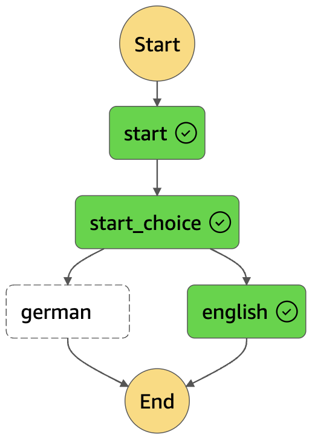
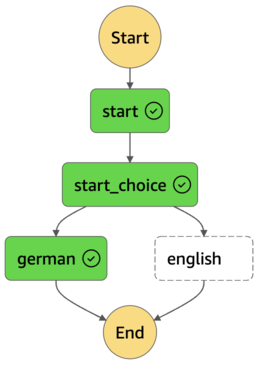

# Simplerubysteps

Simplerubysteps makes it easy to manage AWS Step Functions with ruby.

* Phase I (we are here): Experimenting and exploring the problem and solution domain. The aim is to explore the DSL capabilities and user experience of the automation tool. Things will work, but may change over time. The released gem versions of Simplerubysteps are early alpha versions and therefore should not be used by anyone in production.
* Phase II: First release candidate (possibly rewritten from scratch)
* Phase III: Maintain and evolve

## Installation and Usage

### Prerequisites

* Configured AWS CLI profile with sufficient permissions to create IAM roles and policies, create Lambda functions, create and run Step Functions state machines, run CloudWatch log queries, etc.

### Install the gem and the srs CLI

```
gem install simplerubysteps
```

### Create an AWS Step Function State Machine with the simplerubysteps Ruby DSL

```
mkdir -p samples/hello-world-3
cd samples/hello-world-3

vi workflow.rb
```

#### Hello World State Machine (workflow.rb)

```
require "simplerubysteps"
include Simplerubysteps

GERMAN_WORDS = ["Hallo"]

def is_german?(word)
  GERMAN_WORDS.include? word
end

task :start do
  transition_to :german do |data|
    is_german? data["hi"]
  end

  default_transition_to :english
end

task :german do
  action do |data|
    { hello_world: "#{data["hi"]} Welt" }
  end
end

task :english do
  action do |data|
    { hello_world: "#{data["hi"]} World" }
  end
end
```

### Deploy the Step Functions State Machine and the Lambda function that implements the Task Actions (with srs deploy)

```
export AWS_PROFILE=<AWS CLI profile name with sufficient privileges>
cd samples/hello-world-3

srs deploy
```

### Trigger State Machine executions (with srs start)

```
export AWS_PROFILE=<AWS CLI profile name with sufficient privileges>
cd samples/hello-world-3

export OPEN_AWS_CONSOLE_EXECUTION_DETAILS_PAGE_URL_PREFIX="https://eu-central-1.console.aws.amazon.com/states/home?region=eu-central-1#/v2/executions/details/"
```

#### Sample execution 1 (Hello World)

```
echo '{"hi":"Hello"}'|srs start --wait > result.json
cat result.json|jq -r ".output"|jq -r ".hello_world"
open "$OPEN_AWS_CONSOLE_EXECUTION_DETAILS_PAGE_URL_PREFIX$(cat result.json|jq -r ".execution_arn")"
```



#### Sample execution 2 (Hallo Welt)

```
echo '{"hi":"Hallo"}'|srs start --wait > result.json
cat result.json|jq -r ".output"|jq -r ".hello_world"
open "$OPEN_AWS_CONSOLE_EXECUTION_DETAILS_PAGE_URL_PREFIX$(cat result.json|jq -r ".execution_arn")"
```



### Delete CloudFormation stack (with srs destroy)

```
export AWS_PROFILE=<AWS CLI profile name with sufficient privileges>
cd samples/hello-world-3

srs destroy
```

## License

The gem is available as open source under the terms of the [MIT License](https://opensource.org/licenses/MIT).
